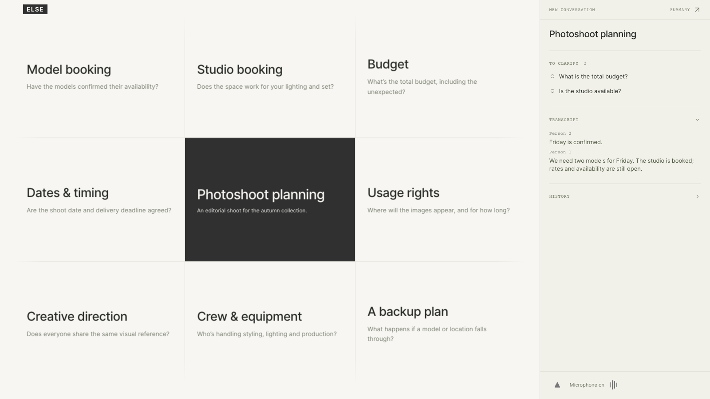
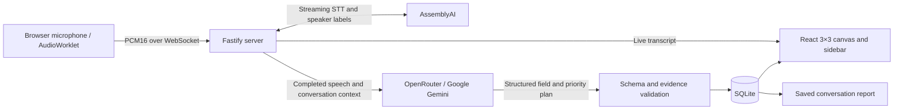

# ELSE

**Think out loud. See what else matters.**

ELSE is a voice-first conversational canvas that listens alongside you, surfaces blind spots and missing questions, and turns live conversations into a visual map of what is settled, what still needs clarification, and what should happen next.

ELSE works while the conversation is happening. A live 3×3 canvas keeps the current topic in the center and surrounds it with eight relevant questions and directions worth exploring.

As the discussion moves, the canvas moves with it. ELSE preserves the transcript, distinguishes suggestions from confirmed decisions, and organizes the conversation into **To clarify**, **Next steps**, and **Settled** in the priority sidebar.

Afterward, a saved Summary captures confirmed points, unresolved questions, next steps, topic history, and the full chronological transcript.



## Demo and submission

Built for the [AssemblyAI Voice Agent Hackathon](https://lablab.ai/ai-hackathons/assemblyai-voice-agent-hackathon), September 2026.

**Source:** [HASHQIX/else-voice-canvas](https://github.com/HASHQIX/else-voice-canvas).

**Pitch deck:** [PDF](submission/presentation/ELSE_Pitch_Deck.pdf) and [editable PowerPoint](submission/presentation/ELSE_Pitch_Deck.pptx).

Hosted demo and video links have not yet been supplied. Submission fields and delivery status are recorded in [submission/submission.json](submission/submission.json). Reusable English copy for the pitch, video, team and seven slides is in [submission/public-copy.txt](submission/public-copy.txt).

## Problem

Important conversations are messy.

People jump between topics, forget questions they meant to ask, leave assumptions unexamined, and often only realize what was missing after the conversation is already over.

Transcription preserves what was said. It does not help you notice what still needs to be said.

## What it does

- Listens to a live conversation in real time.
- Identifies missing information and useful questions.
- Keeps the current topic at the center of a dynamic 3×3 canvas.
- Separates what is To clarify, Next steps, and Settled in the priority sidebar.
- Keeps a live transcript with automatic speaker labels.
- Follows the conversation as topics change.
- Creates a saved Summary with confirmed points, unresolved questions, next steps, topic history, and the full chronological transcript.

**Transcript** shows the newest speech first and starts open; **History** starts collapsed. **Summary ↗** opens a saved, copyable report in a new tab. **New Conversation** starts a fresh context; previous saved conversations remain in storage.

## Use cases

- **Project planning** — Uncover missing constraints and unresolved decisions.
- **Negotiations** — Keep important questions and commitments visible.
- **Interviews** — Surface unanswered areas while there is still time to ask.
- **Creative brainstorming** — Explore overlooked directions without losing what has already been decided.
- **Everyday decisions** — Turn an unstructured discussion into clear next steps.

The product interface and generated cards are English.

## Why voice

Conversation is already the most natural interface for thinking together.

Participants simply continue the conversation while ELSE listens, identifies what may be missing, and updates the shared visual space in the background.

Voice is the source of the conversation itself, while the canvas becomes its evolving visual structure. ELSE currently responds visually rather than speaking back, keeping the conversation between the people involved.

## How it works

**Speak → Transcribe → Understand → Surface gaps → Organize → Continue the conversation**

The transcript is the input. ELSE’s output is a continuously changing shared view of the conversation: what matters now, what may have been missed, what has been decided, and what should be explored next.

ELSE helps people shape the conversation while it is still happening.

**ELSE doesn't just remember what was said. It helps you see what still needs to be said.**

## How AssemblyAI is used

ELSE uses **AssemblyAI Streaming Speech-to-Text v3** with the **Universal-3.6 Pro Realtime** model (`universal-3-6-pro`) as its real-time voice layer.

Microphone audio is captured in the browser through an AudioWorklet, converted to mono PCM16 at 16 kHz, and streamed through the server to AssemblyAI over WebSocket. Partial and final turns update the live transcript continuously, while completed turns trigger the background analysis that updates the conversational canvas.

Streaming speaker diarization is enabled with `speaker_labels=true`, so the interface can distinguish between participants without manual speaker assignment. Labels appear as **Person 1**, **Person 2**, and so on, or **Unknown** when no reliable label is available.

AssemblyAI makes the live experience possible: participants can keep speaking while transcription feeds context to Google Gemini through OpenRouter, which generates the questions and priorities. All provider credentials remain on the server.

Speaker labels are automatic and scoped to a microphone session. When a connection restarts, the transcript distinguishes sessions rather than assuming that the same number identifies the same person. The implementation currently uses the dominant speaker for each turn, not word-level separation or SpeakerRevision. ELSE uses Streaming STT; it does not use the Voice Agent API or LLM Gateway.

## Architecture



**Stack:** React, TypeScript, Vite, Fastify, WebSocket, SQLite, AssemblyAI Streaming STT and Google Gemini via OpenRouter. The current planner model is `google/gemini-3.8-flash`.

## Run locally

Use Node **24.21.0** (matching the Docker image and package engine). API access to AssemblyAI and OpenRouter is required for a live conversation.

```sh
npm ci
cp .env.example .env
```

Set `ASSEMBLYAI_API_KEY` and `OPENROUTER_API_KEY` in the private `.env` file. Keep `LLM_PROVIDER=openrouter` and the supplied model IDs unless intentionally changing the providers. `DAILY_LLM_BUDGET_USD` must be positive.

Run these in separate terminals:

```sh
npm run dev
```

```sh
npm run dev:client
```

Open `http://localhost:5173`, allow microphone access, and speak. If permission or autoplay is blocked, use **Microphone On** to retry. The triangle in the sidebar footer pauses/resumes capture. No personal account is needed; an HTTP-only guest cookie scopes each visitor's data.

Try: “We are planning an editorial photoshoot next Friday. We still need to agree on a budget and book two models.” Then discuss one of the surrounding questions and watch it move to the center. Confirm a detail, retract it, and inspect how the priorities change. Open **Summary** to copy the result.

## Environment

See [.env.example](.env.example) for the full configuration.

| Variable | Purpose |
| --- | --- |
| `ASSEMBLYAI_API_KEY` | Server-side live transcription and speaker labels |
| `OPENROUTER_API_KEY` | Server-side Gemini analysis |
| `APP_ORIGIN` | Exact application origin; production requires HTTPS |
| `SESSION_SECRET` | Stable cookie-signing secret, at least 32 characters in production |
| `DATABASE_PATH` | Persistent SQLite path; Docker uses `/data/else.sqlite` |
| `DAILY_LLM_BUDGET_USD` | Estimated application analysis/TTS allowance; separate from AssemblyAI billing |
| `DEMO_ACCESS_CODE` | Optional demo gate; leave empty for direct judge access |

Never place keys in `VITE_*` variables, the frontend, Git or submission media.

## Production deployment

Deploy as **one persistent Node/container service** with WebSocket support and a writable volume for SQLite. The browser, API, `/api/live/*` WebSocket and `/report/*` routes must share an HTTPS origin. The frontend alone is not a deployable version of this app.

1. On the host, create the private `.env` from the example. Set `APP_ORIGIN=https://your-domain.example` and a strong, stable `SESSION_SECRET`. Generate a secret with `node -e "console.log(require('node:crypto').randomBytes(32).toString('hex'))"` and store it privately.
2. Run `docker compose up -d --build`. [compose.yaml](compose.yaml) preserves `/data` and binds the service to host loopback on port 3000.
3. Configure HTTPS using [Caddyfile.example](Caddyfile.example), replacing its domain with the actual domain. Caddy must run on the same host for that loopback address.
4. Verify `/healthz`, then `/readyz` (`voiceReady: true` means credentials/budget are configured, not that a live provider call was tested).
5. From a fresh browser profile, allow the microphone, speak, check the live transcript and nine cards, pause/resume, open Summary, and start a new conversation. Test the actual public URL before submitting it.

For a non-container host, run `npm run build` then `npm start`, with `NODE_ENV=production`, the same environment variables and a persistent database path. The server serves `dist/web` directly. Production rejects a missing/non-HTTPS `APP_ORIGIN` and a missing/short signing secret at startup.

## Validation

```sh
npm run typecheck
npm test
npm run build
npm run test:production
```

With Vite running and Chrome installed, `npm run test:browser` checks the canvas, transcript, report, reset and microphone lifecycle using isolated mocked services and a synthetic microphone. It does not record the user's microphone. Live synthetic STT, speaker-label and planner checks are in `validation/`; their results are not a guarantee of recognition accuracy in every environment.

## Data and limitations

- Legacy API adapters and branching routes remain internally; the current UI does not expose scenario forking or branch comparison.
- Audio is sent to AssemblyAI; transcript/context is sent to OpenRouter for Gemini analysis. The app stores text, speaker labels and conversation state in SQLite, not raw microphone recordings. Provider retention policies are separate.
- Report URLs are private to the original guest browser cookie. They are exports for copying, not public share links.
- Guest cleanup runs on server startup; inactive guest records are eligible after `GUEST_RETENTION_DAYS` (default 7). New Conversation does not delete older stored projects.
- Voice attribution can be wrong for short, noisy or overlapping speech. It does not identify names or roles, and identities are not linked across microphone sessions.
- Plan updates follow completed speech and provider response time. Interim speech arrives sooner. Automatic speech sessions renew after roughly ten minutes, with a brief capture interruption.
- A field is capped at 250 topics. Analysis budgets are fixed estimates, not exact provider-billed cost accounting; AssemblyAI STT is not included in that budget.
- This prototype is not validated for medical decisions. Suggestions are questions, and confirmed reported symptoms are not diagnoses.
- Multiple application replicas need shared state and session coordination; the supplied deployment is a single-instance prototype.

## License

[MIT](LICENSE). Third-party dependencies retain their respective licenses. `PLAN/spec/` contains historical design documents; the README describes the current ELSE experience.
